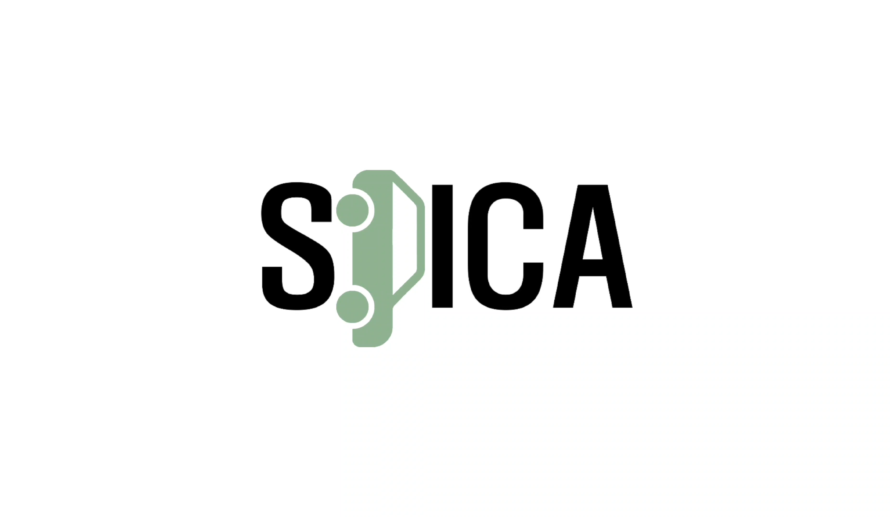
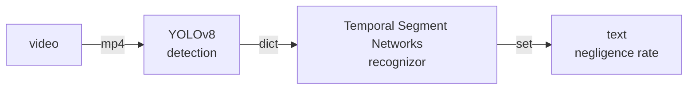

# AI-based Traffic Accident Negligence Measurement Program

<p align="center">
    
</p>


> 주어진 비디오를 입력으로 받아 객체 감지 및 분석을 통해 사전에 정의된 435가지 상황 데이터 중 가장 유사한 상황을 예측하여 과실 비율을 측정하는 프로그램입니다.

---

## 프로젝트 소개

이 프로젝트는 교통사고 영상을 입력 받아 **사전에 정의된 435가지 사고 상황 중 가장 유사한 상황을 예측하고, 과실 비율을 측정**하는 AI 기반 분석 프로그램입니다. 사용자는 비디오를 업로드하면 객체 감지 및 상황 인식을 통해 교통사고 과실 분석 결과를 받아볼 수 있습니다. 

이 프로그램은 YOLOv8 객체 탐지와 Temporal Segment Networks(TSN)를 사용해 실시간으로 교통사고 데이터를 분석하여 높은 정확도의 사고 상황 예측을 가능하게 합니다. YOLOv8는 고속 객체 탐지에 최적화되어 사고 영상에서 표지판, 횡단보도 등을 빠르게 감지하는 데 적합하며, TSN은 교통사고와 같은 연속적인 이벤트를 시간에 따라 분석하는 데 강력한 성능을 발휘합니다. 이러한 기술의 조합을 통해 상황 인식 및 과실 비율 예측의 정확도를 높일 수 있었습니다.

프로젝트 진행 중 직면했던 주요 문제는 **다양한 사고 상황에서 객체 인식의 일관성을 유지하는 것**과 **시간에 따른 사고 맥락을 정확하게 해석하는 것**이었습니다. 

> [TSN (Temporal Segment Networks) 학습 가이드](https://github.com/grayson1999/TSNAccidentAnalysis)



---

## 주요 기술 스택

- **YOLOv8**: 고속 객체 탐지에 최적화된 모델로, 사고 영상 내 차량, 보행자 등 객체를 빠르게 감지하여 사고 상황 분석에 활용됩니다.
- **TSN (Temporal Segment Networks)**: 시간에 따른 연속적 이벤트를 분석하는 네트워크로, 교통사고와 같은 상황 인식에 강점을 가지고 있어 사고 맥락을 정확하게 해석할 수 있습니다.
- **FastAPI**: 빠르고 간편한 API 서버 구성을 위한 프레임워크로, RESTful API 형태로 과실 비율 분석 결과를 제공합니다.
- **Docker**: 환경 구성을 일관되게 관리할 수 있도록 하여 모델 배포 및 실행 환경 설정을 효율화합니다.


아래는 해당 글을 바탕으로 작성한 목차입니다:

---

## 목차
1. [프로젝트 소개](#프로젝트-소개)
2. [주요 기술 스택](#주요-기술-스택)
3. [목차](#목차)
4. [요구 사항](#요구-사항)
5. [데이터 설명](#데이터-설명)
6. [설치 및 실행](#설치-및-실행)
    - [환경설정](#환경설정)
    - [Single_TSN_model](#single_tsn_model)
    - [Yolo_TSN_model](#yolo_tsn_model)
    - [FastAPI](#fastapi)
7. [API 주소](#api-주소)
8. [아키텍처 (디렉토리 구조 등)](#아키텍처-디렉토리-구조-등)
9. [모델 정확도](#모델-정확도)
10. [테스트](#테스트)
11. [Version Control](#version-control)
12. [참고자료](#참고자료)

---

이 목차는 각 항목에 직접 접근할 수 있도록 구조화되어 있어, 가독성과 탐색이 용이할 것입니다.

## 요구 사항
- Docker 및 Python
- 필요 패키지 목록은 `requirements.txt`에 명시

## 데이터 설명

- [AI-Hub](https://www.aihub.or.kr/aihubdata/data/view.do?currMenu=&topMenu=&aihubDataSe=data&dataSetSn=597)
    
    - 데이터 설명서
    <br>[1-56 교통사고 영상 데이터_데이터설명서_v1.0.pdf](./asset/1-56%20교통사고%20영상%20데이터_데이터설명서_v1.0.pdf)
    - 데이터 사고유형별 index
    <br>[Incident_Type_Classification_Table.csv](./files/Incident_Type_Classification_Table.csv)

## 설치 및 실행
### 환경설정
- docker 빌드
    ```bash
    # 버전 수정
    ARG PYTORCH="1.6.0"
    ARG CUDA="10.1"
    ARG CUDNN="7"
    ```
    ```bash
    # build an image with PyTorch 1.6.0, CUDA 10.1, CUDNN 7.
    docker build -f ./docker/Dockerfile --rm -t accidentfaultai .

    # docker run --gpus all --shm-size=8g -it accidentfaultai
    docker run --gpus all --shm-size=8g -it -v G:/:/AccidentFaultAI/datasets/data accidentfaultai

    ```
    ```bash
    #additional comments
    pip install mmcv==2.1.0
    pip install -r requirements/build.txt
    python setup.py develop
    pip install pandas
    ##for yolo
    pip install --upgrade pip
    pip install numpy --upgrade
    pip install ultralytics
    pip install opencv-contrib-python==4.5.5.62
    ##for fast api
    pip install fastapi
    pip install "uvicorn[standard]"
    pip install python-multipart
    pip install jinja2
    ```

### Single_TSN_model
- 경로 수정
    ```python
    ## ./recognizer/single_tsn_recognizer.py
    config = '/AccidentFaultAI/model/TSN/best_model_0527/tsn_imagenet-pretrained-r50_8xb32-1x1x3-100e_kinetics400-rgb.py'
    checkpoint = '/AccidentFaultAI/model/TSN/best_model_0527/best_model_0527.pth'
    video = '/AccidentFaultAI/recognizer/demo_video/cc_5.mp4'
    ```
- run   
    ```bash
    python ./recognizer/single_tsn_recognizer.py
    ```
### Yolo_TSN_model
- 경로 수정
    ```python
    ## ./recognizer/yolo_tsn_recognizer.py
    config = '/AccidentFaultAI/model/TSN/best_model_0527/tsn_imagenet-pretrained-r50_8xb32-1x1x3-100e_kinetics400-rgb.py'
    checkpoint = '/AccidentFaultAI/model/TSN/best_model_0527/best_model_0527.pth'
    video = '/AccidentFaultAI/recognizer/demo_video/cc_5.mp4'
    ```
- run   
    ```bash
    python ./recognizer/yolo_tsn_recognizer.py
    ```
### FastAPI
- run   
    ```bash
    python ./fastapi/videoRecognizerAPI.py
    ```
 
## API 주소

- **API 엔드포인트**:
    - `localhost:8000/`: 메인 페이지로, 간단한 비디오 업로드 기능 구현
    - `localhost:8000/predict`: 비디오 입력에 대한 과실 예측 결과를 반환하는 엔드포인트
    
    ```bash
    curl -X POST "<http://127.0.0.1:8000/predict>" -F "video=@C:/Users/Downloads/demo.mp4"
    
    ```
    
    - **응답 형식**: JSON

## 아키텍처 (디렉토리 구조 등)

- `recognizer/`: TSN 및 YOLO 기반 인식 모듈
- `model/`: 학습된 모델 파일 및 구성
- `docker/`: Docker 설정 파일

## 모델 정확도
|     모듈     |      모델 설명          |  top_1 정확도    |     top_5 정확도    |     rate 정확도    |    ±10% error rate 정확도    |    평균 코사인 유사도   |
|--------------|-----------------------|------------------|---------------------|-------------------|-----------------------------|-------------------------|
|single_tsn_model|TSN(best_model_0522)|20.6|·|29.9|·|·|
|single_tsn_model|TSN(best_model_0527)|23.0|46.8|32.0|·|·|
|yolo_tsn_model|TSN(best_model_0527)+yolov8n|22.1|47.2|31.8|·|·|
|single_tsn_model|TSN(best_model_0529)|24.67|48.90|33.50|46.83|81.54|
|yolo_tsn_model|TSN(best_model_0529)+yolov8n|23.50|49.48|33.43|47.3|81.58|
|single_tsn_model|TSN(best_model_0531)|21.50|45.36|30.63|44.92|·|

### 테스트

- 모델 성능 평가
    
    
    | 모듈 | 모델 설명 | top_1 정확도 | top_5 정확도 | rate 정확도 | ±10% error rate 정확도 | 평균 코사인 유사도 |
    | --- | --- | --- | --- | --- | --- | --- |
    | single_tsn_model | TSN(best_model_0522) | 20.6 | · | 29.9 | · | · |
    | single_tsn_model | TSN(best_model_0527) | 23.0 | 46.8 | 32.0 | · | · |
    | yolo_tsn_model | TSN(best_model_0527)+yolov8n | 22.1 | 47.2 | 31.8 | · | · |
    | single_tsn_model | TSN(best_model_0529) | 24.67 | 48.90 | 33.50 | 46.83 | 81.54 |
    | yolo_tsn_model | TSN(best_model_0529)+yolov8n | 23.50 | 49.48 | 33.43 | 47.3 | 81.58 |
    | single_tsn_model | TSN(best_model_0531) | 21.50 | 45.36 | 30.63 | 44.92 | · |


- 테스트 코드 실행

```bash
# single_tsn_tester 실행 및 로그 파일 생성
python ./tester/single_tsn_tester.py > single_tsn_tester_log.txt

# yolo_tsn_tester 실행 및 로그 파일 생성
python ./tester/yolo_tsn_tester.py > yolo_tsn_log.txt
```


## Version Control

| 버전       | 날짜      | 변경 내용                                |
|------------|-------------|------------------------------------------|
|0.1|24.05.22|초기 repository 설정 및 초기 video-swin-transformer 버전 업로드|
|0.2|24.05.22|main, video-swin-transformer의 readme.md 작성|
|0.3|24.05.22|사고 유형을 통해 과실 비율 등 검색 모듈 추가(accidentSerch)|
|0.3.1|24.05.24|main docker file 및 model 업로드|
|0.3.2|24.05.24|main docker file 수정, single_tsn_teater 제작, main readme 환경 설정 섹션 추가|
|0.3.3|24.05.25|video-swin-transformer를 main 폴더로 정리|  
|0.3.4|24.05.27|video-swin-transformer를 [TSNAccidentAnalysis](https://github.com/grayson1999/TSNAccidentAnalysis)으로 분리, docker file 수정|  
|0.4|24.05.27|docker 환경 구축, single_tsn_model 테스트| 
|0.4.1|24.05.27|top_5 acc 추가, 모델(best_model_0527) 추가|
|0.5|24.05.27|recognizer 제작|
|0.5.1|24.05.27|incident_Type 컬럼 명 영어로 변경 및 모듈 대응|
|0.5.2|24.05.27|yolo readme 추가|
|0.5.3|24.05.28|yolo_tsn_model 테스트, detection filter 제작|
|0.6|24.05.28|yolo_tsn_recognizer 제작 및 class화|
|0.6.1|24.05.28|single_tsn_recognizer class화 및 패키지화|
|0.7|24.05.28|fast api로 api 서버 제작| 
|0.7.1|24.05.30|best_model_0529 테스트, ±10% error rate 정확도 테스터 제작|
|0.7.2|24.05.30|TSN(best_model_0529)+yolov8n 정확도 테스트|
|0.7.3|24.06.01|TSN(best_model_0531) 정확도 테스트|
|0.8.0|24.06.02|코사인 유사도 test 모듈 제작|


## 참고자료

### Object Detection 관련 자료
- [YOLO v8 Car Crash Detection | Road Accident Detection Project (YouTube)](https://www.youtube.com/watch?v=Hk2lGL1_EEg&t=263s)
- [GitHub Repository - freedomwebtech/yolov8-vehicle-crash-detection](https://github.com/freedomwebtech/yolov8-vehicle-crash-detection/tree/main)
- [GitHub Repository - shubhankar-shandilya-india/Accident-Detection-Model: Accident Detection Model using Deep Learning, OpenCV, Machine Learning, AI](https://github.com/shubhankar-shandilya-india/Accident-Detection-Model/tree/master)
- [YOLOv8 Custom Data Training Tutorial (YouTube)](https://www.youtube.com/watch?v=em_lOAp8DJE)
- [YOLO v5 Custom Training Tutorial (YouTube)](https://www.youtube.com/watch?v=T0DO1C8uYP8)

